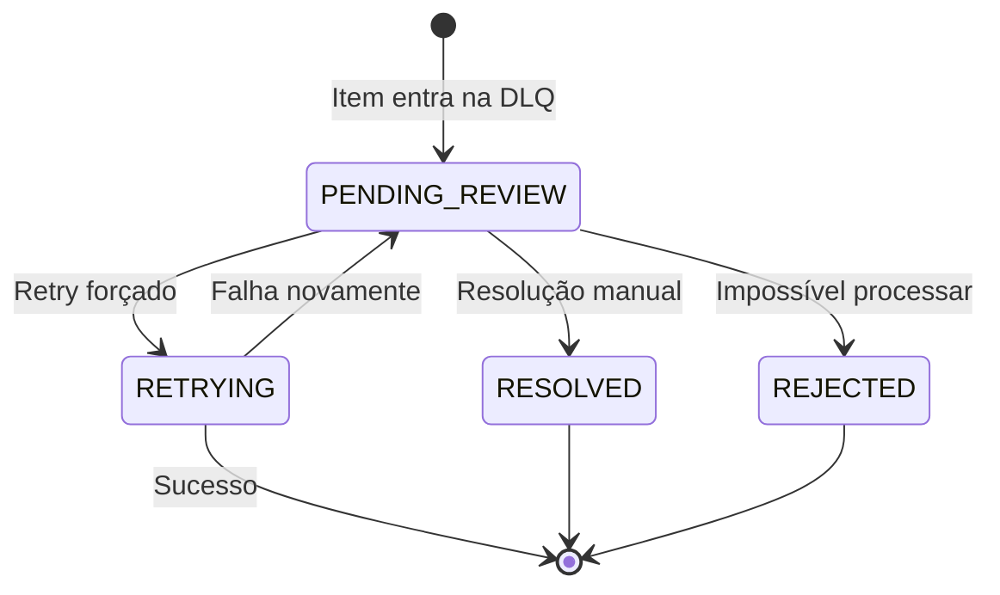

# DomniWallet - Runbook Operacional

Procedimentos para RBF/CPFP, DLQ e incidentes comuns (BTC/Liquid).

---

## Índice

1. [Transação BTC Stuck (RBF)](#transação-btc-stuck-rbf)
2. [Acelerar com CPFP](#acelerar-com-cpfp)
3. [DLQ - Dead Letter Queue](#dlq---dead-letter-queue)
4. [Circuit Breaker Aberto](#circuit-breaker-aberto)
5. [Hot Wallet com Saldo Baixo](#hot-wallet-com-saldo-baixo)
6. [Consolidação de UTXOs](#consolidação-de-utxos)
7. [Reorg e UTXO Revertido](#reorg-e-utxo-revertido)
8. [Tron Payout Falhou](#tron-payout-falhou)

---

## Transação BTC Stuck (RBF)

### Sintomas
- Tx no mempool por > 1 hora
- 0 confirmações
- Alerta `PayoutLatencyHigh`

### Diagnóstico

```bash
# Verificar status da tx
bitcoin-cli gettransaction <txid>

# Verificar fee rate atual
bitcoin-cli getmempoolentry <txid>

# Comparar com mempool
curl -s https://mempool.space/api/v1/fees/recommended
```

### Resolução (RBF)

> [!IMPORTANT]
> Só funciona se a tx original foi criada com `replaceable=true` (RBF enabled).

```bash
# 1. Calcular novo fee (target: próximo bloco)
NEW_FEE=$(bitcoin-cli estimatesmartfee 2 | jq '.feerate')

# 2. Bump fee
bitcoin-cli bumpfee <txid> '{"fee_rate": '$NEW_FEE'}'

# 3. Verificar nova tx
bitcoin-cli gettransaction <new_txid>
```

### Via API (se implementado)

```bash
curl -X POST https://api.domini.pay/v1/payouts/<payout_id>/bump-fee \
  -H "Authorization: Bearer $TOKEN" \
  -d '{"target_blocks": 2}'
```

### Checklist Pós-Resolução

- [ ] Nova tx confirmada
- [ ] Status do payout atualizado para COMPLETED
- [ ] Auditoria registra ambos txids

---

## Acelerar com CPFP

### Quando Usar
- RBF não disponível (tx original sem flag)
- Controlamos o output de change
- Urgência alta

### Procedimento

```bash
# 1. Identificar output de change
bitcoin-cli gettransaction <txid> | jq '.details[] | select(.category=="send")'

# 2. Criar tx gastando o change com fee alta
bitcoin-cli createrawtransaction \
  '[{"txid":"<txid>","vout":<change_vout>}]' \
  '{"<destino>": <valor_menos_fee>}'

# 3. Assinar
bitcoin-cli signrawtransactionwithwallet <raw_tx>

# 4. Broadcast
bitcoin-cli sendrawtransaction <signed_tx>
```

> [!CAUTION]
> CPFP aumenta custos significativamente. Usar apenas quando necessário.

---

## DLQ - Dead Letter Queue

### O que vai para DLQ
- Payouts com 3+ falhas
- Erros não-retryable
- Timeouts esgotados

### Consultar DLQ

```bash
# Listar itens
curl https://api.domini.pay/v1/admin/dlq?limit=50

# Detalhes de um item
curl https://api.domini.pay/v1/admin/dlq/<dlq_id>
```

### Processar Item da DLQ

```bash
# 1. Analisar causa
curl https://api.domini.pay/v1/admin/dlq/<dlq_id>/events

# 2. Decidir ação
# Opção A: Retry forçado
curl -X POST https://api.domini.pay/v1/admin/dlq/<dlq_id>/retry

# Opção B: Marcar como resolvido manualmente
curl -X POST https://api.domini.pay/v1/admin/dlq/<dlq_id>/resolve \
  -d '{"resolution": "manual_refund", "notes": "Reembolso via PIX"}'

# Opção C: Rejeitar permanentemente
curl -X POST https://api.domini.pay/v1/admin/dlq/<dlq_id>/reject \
  -d '{"reason": "invalid_destination"}'
```

### Workflow de DLQ



### Alertas de DLQ

| Condição | Ação |
|----------|------|
| > 5 itens novos em 1h | Alert Warning |
| > 20 itens pendentes | Alert Critical |
| Item > 24h sem review | Alert Warning |

---

## Circuit Breaker Aberto

### Sintomas
- Alerta `CircuitBreakerOpen`
- Métrica `domini_circuit_breaker_state{network="X"} = 1`
- Payouts da rede X retornando 503

### Diagnóstico

```bash
# Verificar estado
curl https://api.domini.pay/v1/admin/circuit-breakers

# Verificar últimas falhas
curl https://api.domini.pay/v1/admin/circuit-breakers/btc/failures?limit=10
```

### Resolução

```bash
# 1. Verificar se o node está healthy
bitcoin-cli getblockchaininfo  # BTC

# 2. Se node OK, reset manual do circuit breaker
curl -X POST https://api.domini.pay/v1/admin/circuit-breakers/btc/reset \
  -H "Authorization: Bearer $ADMIN_TOKEN"

# 3. Monitorar recovery
watch -n 5 'curl -s https://api.domini.pay/v1/admin/circuit-breakers'
```

### Fila de Payouts Pendentes

Quando circuit abre, payouts são enfileirados. Ao resetar:

```bash
# Verificar fila
curl https://api.domini.pay/v1/admin/circuit-breakers/btc/queue

# Processar fila (automático ao reset, mas pode forçar)
curl -X POST https://api.domini.pay/v1/admin/circuit-breakers/btc/process-queue
```

---

## Hot Wallet com Saldo Baixo

### Alerta
- `HotWalletLow` ou `HotWalletCritical`
- Métrica `domini_hot_wallet_balance_sats{network="X"} < threshold`

### Verificar Saldo

```bash
# BTC
bitcoin-cli getbalance

# Liquid
elements-cli getbalance
```

### Reabastecer Hot Wallet

> [!CAUTION]
> Requer aprovação humana. Nunca automatizar.

1. **Criar ticket** no sistema de aprovações
2. **Aprovar** por 2+ stakeholders
3. **Executar** transferência da cold wallet:

```bash
# BTC: enviar da cold para hot
bitcoin-cli -rpcwallet=cold sendtoaddress "<hot_address>" <amount>

```

4. **Confirmar** saldo atualizado
5. **Registrar** no audit log

---

## Consolidação de UTXOs

### Quando Consolidar
- Alerta `UTXOFragmentation` (> 100 UTXOs)
- Antes de período de alta demanda
- Quando fees estão baixas

### Verificar Estado

```bash
# Contar UTXOs
bitcoin-cli listunspent | jq 'length'

# Valor total
bitcoin-cli listunspent | jq '[.[].amount] | add'
```

### Executar Consolidação

```bash
# 1. Estimar fee (usar tier slow)
FEE_RATE=$(bitcoin-cli estimatesmartfee 12 | jq '.feerate * 100000')

# 2. Criar transação de consolidação
# Todos UTXOs → 1 output para si mesmo
bitcoin-cli sendtoaddress "<hot_wallet_address>" \
  $(bitcoin-cli getbalance) \
  "" "" true true null "unset" null $FEE_RATE

# 3. Verificar
bitcoin-cli listunspent | jq 'length'  # Deve ser 1 após confirmar
```

### Agendamento Recomendado

| Dia | Horário (UTC) | Condição |
|-----|---------------|----------|
| Domingo | 02:00 | Se UTXOs > 50 |
| Qualquer | — | Se fees < 5 sat/vB |

---

## Checklist de Incidente

### Durante

- [ ] Identificar escopo (rede, quantidade de payouts afetados)
- [ ] Verificar se circuit breaker acionou
- [ ] Comunicar status aos stakeholders
- [ ] Documentar ações tomadas

### Pós-Incidente

- [ ] RCA (Root Cause Analysis)
- [ ] Atualizar runbook se necessário
- [ ] Revisar alertas e thresholds
- [ ] Criar ticket para melhorias

---

## Contatos de Escalação

| Nível | Quem | Quando |
|-------|------|--------|
| L1 | On-call engineer | Qualquer alerta |
| L2 | Tech lead | Circuit breaker > 5 min |
| L3 | CTO | Hot wallet < 20%, DLQ > 50 |

---

## Reorg e UTXO Revertido

### Sintomas
- UTXO confirmado some do balance
- Confirmações voltam para 0
- Alerta de reconciliação

### Ação
1. Reprocessar bloco/altura afetada no watcher
2. Atualizar estado do UTXO (confirmed → mempool/reorged)
3. Se UTXO estava reservado, liberar a reserva
4. Reconciliar saldo com base em <code>chain_utxos</code>

---

## Tron Payout Falhou

### Sintomas
- Tx de USDC não confirmada
- Erro de energia/bandwidth
- Saldo TRX insuficiente

### Ação
1. Verificar saldo de TRX para taxas (energy/bandwidth)
2. Reprocessar payout e monitorar confirmações
3. Se falhar, marcar como FAILED_RETRYABLE e refileirar
